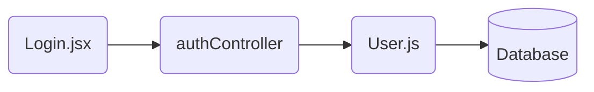
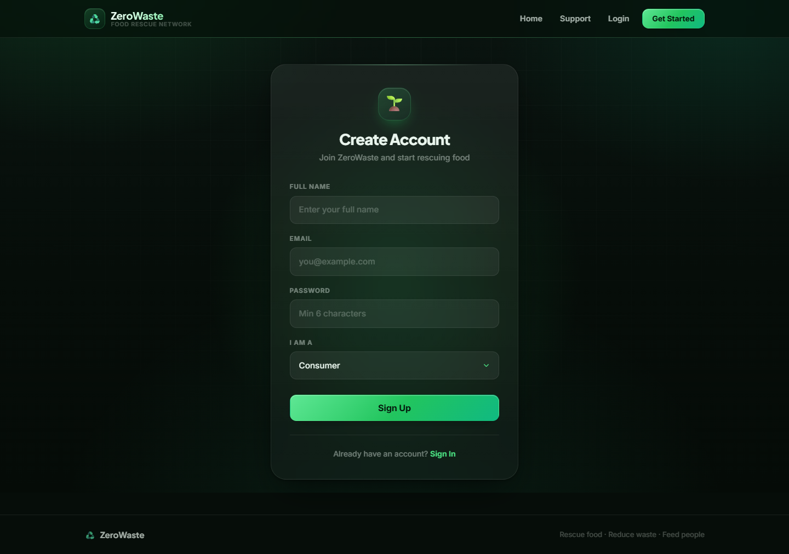
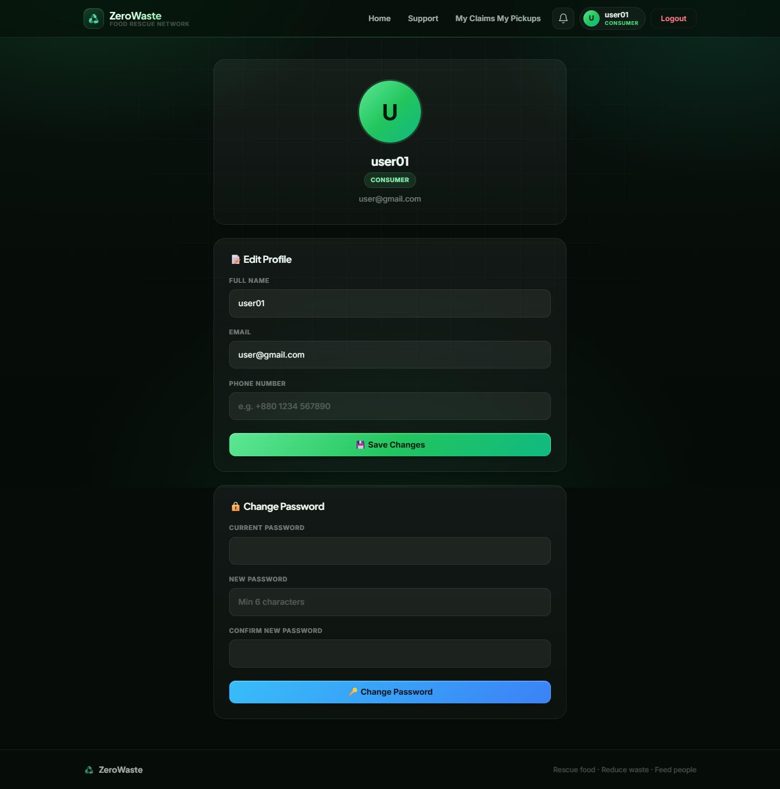
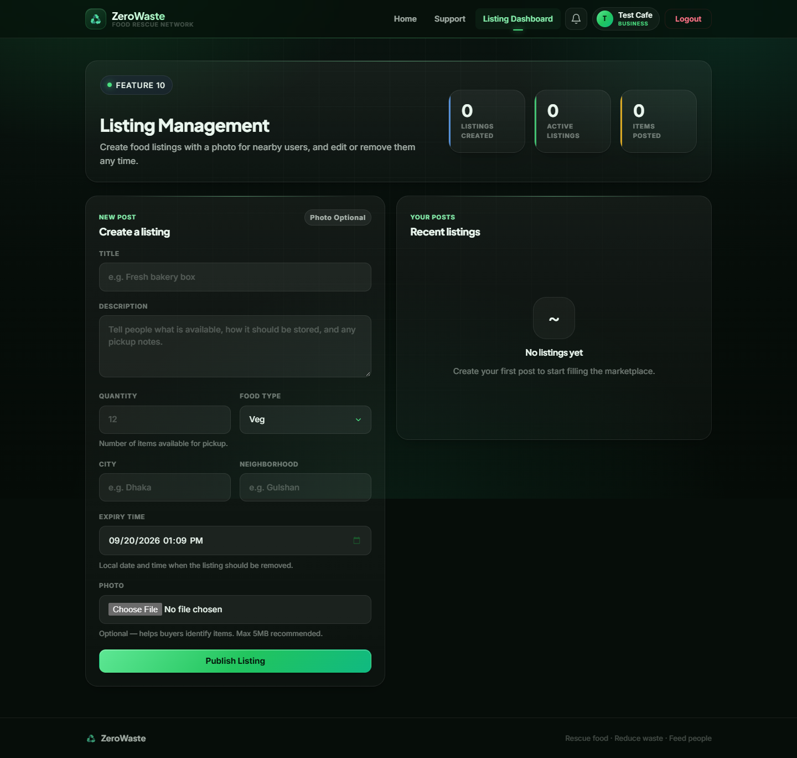
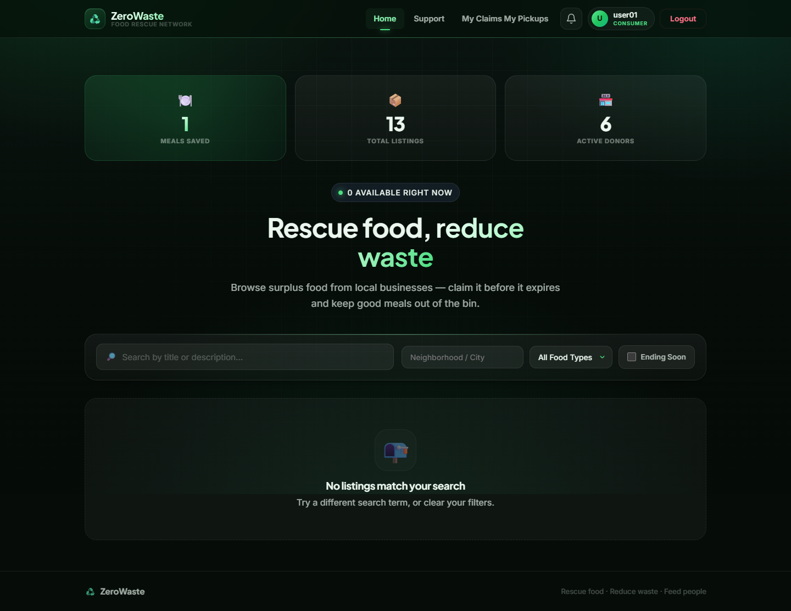
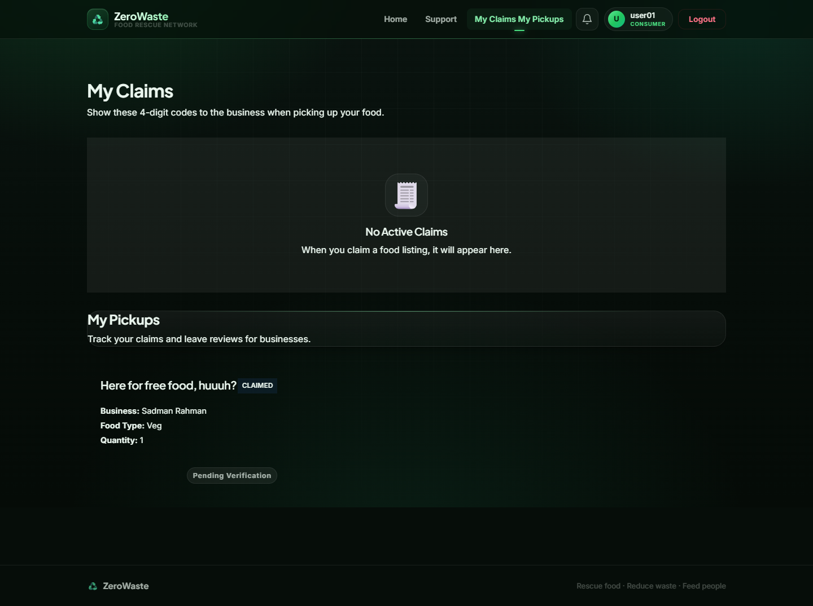
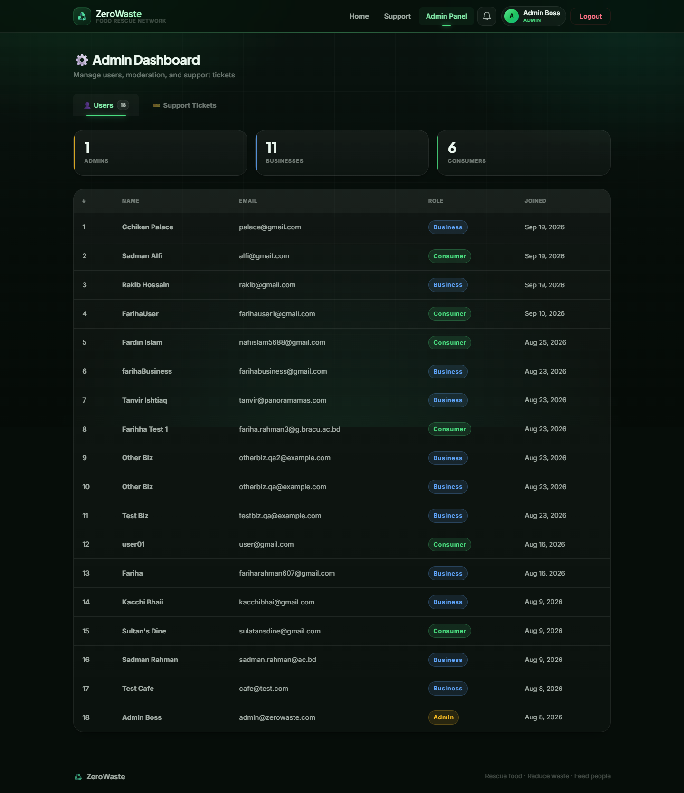
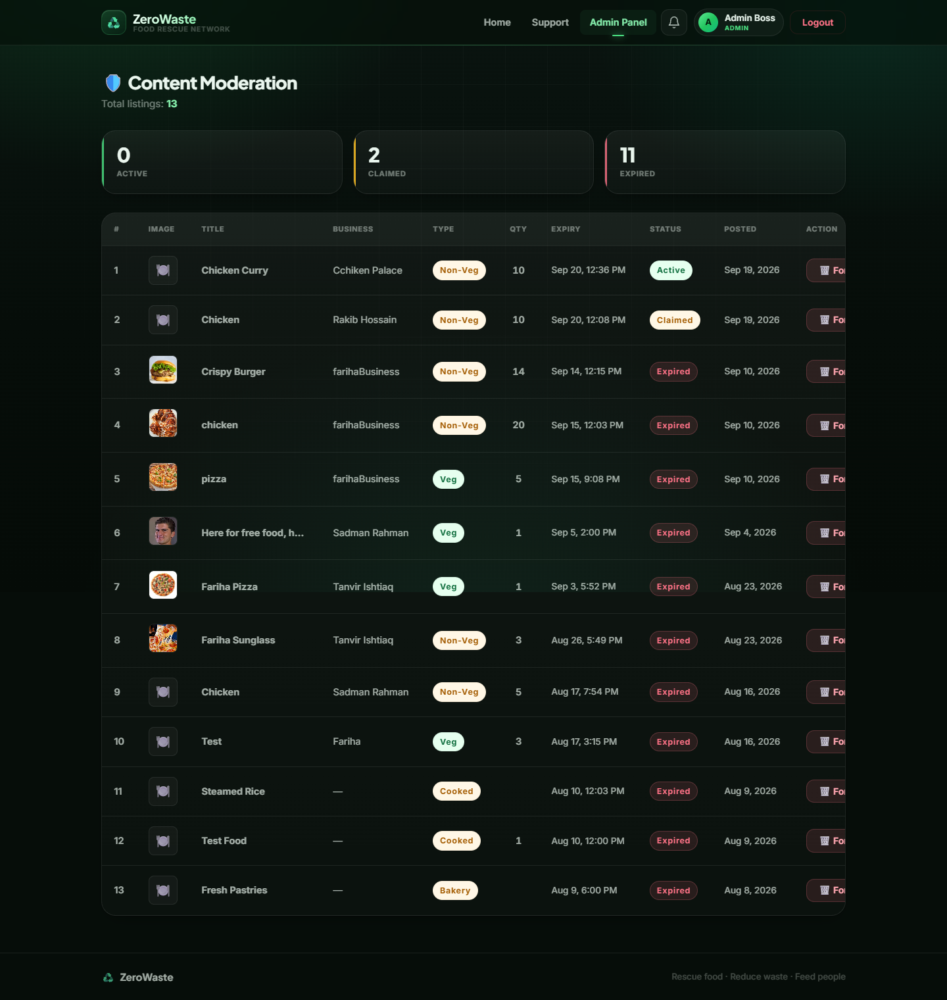

# 🌍 Project Report: ZeroWaste
*Bridging the gap between food surplus and food scarcity.*

---

## 1. Project Overview & Problem Statement

### The Global Crisis of Food Waste
Every single day, restaurants, bakeries, and grocery stores discard millions of pounds of perfectly edible food simply because it didn’t sell before closing time. Simultaneously, local communities continue to face rising food costs and food insecurity. This creates a heartbreaking paradox: **we have an abundance of food, yet it ends up decomposing in landfills, generating harmful methane gases that accelerate climate change.**

### The ZeroWaste Solution
**ZeroWaste** is a digital food rescue network built to intercept this waste. We provide a seamless platform that connects local food-based businesses directly with everyday consumers. 
- **For Businesses:** It offers a streamlined, socially responsible way to offload daily surplus inventory—reducing disposal costs and building community goodwill.
- **For Consumers:** It provides a real-time marketplace to claim high-quality, heavily discounted (or free) meals before they are thrown away.
- **For the Environment:** Every meal rescued is a direct reduction in the carbon footprint associated with commercial food waste.

---

## 2. Software Development Process (Agile & Sprints)
To manage the complexity of building a multi-role platform, our team utilized an **Agile Software Development Process** driven by iterative **Sprints**. 

- **Iterative Planning:** We broke down the project into distinct Sprints. For example, *Sprint 1* focused exclusively on building the core foundation: Secure Authentication, the global React shell, and the Admin oversight dashboard.
- **Role Allocation:** Features were divided among four team members, each taking ownership of specific modules (User Authentication, Marketplace Core, Claim/Verification Engine, and Platform Analytics).
- **Continuous Integration:** By developing in Sprints, we could test and integrate independent modules (like the Login system and the Listing system) progressively, ensuring the app remained stable at the end of every cycle.

---

## 3. Technology Stack (MERN)
To deliver a fast, responsive, and real-time experience, we architected ZeroWaste on the **MERN** stack:
- **Frontend (React.js):** A dynamic, single-page application (SPA) providing an interactive UI.
- **Backend (Express.js & Node.js):** A lightweight, highly scalable RESTful API handling business logic.
- **Database (MongoDB & Mongoose):** A flexible NoSQL database perfectly suited for handling diverse data shapes.

---

## 4. MVC Architecture Implementation (Core Feature)

To keep our codebase organized, we adhered to the **Model-View-Controller (MVC)** architectural pattern. Here is the MVC breakdown for our most critical feature: **Role-Based Registration & Login**.

- **Model (`User.js`)**: Defines the data blueprint. It enforces uniqueness for emails, dictates the user roles (Admin, Business, Consumer), and securely hashes passwords before they hit the database.
- **View (`Login.jsx`)**: The presentation layer. A React component that captures user input, provides immediate visual validation, and sends the credential payload to the backend.
- **Controller (`authController.js`)**: The brain of the operation. It receives the request, queries the Model to verify credentials, and if successful, signs and returns a secure JWT token back to the View.

---

## 5. User Demonstration: 20 Core Features

Our platform offers a comprehensive suite of features tailored to our three distinct user roles. Below is a demonstration of the 20 features implemented across the application:

### User Identity & Security
**1. Role-Based Registration:** Users select their account type (Consumer, Business, Admin) upon signup.
**2. Role-Based Login:** Users log in and are automatically routed to their specific dashboard based on their role.
  

**3. Profile Management:** Users can seamlessly update their personal details and contact information.
  

**4. Password Security:** Users can securely change their passwords, backed by bcrypt hashing.
**5. Session Management:** The system automatically logs users out when their secure session (JWT) expires.

### Business & Marketplace Features
**6. Create Food Listing:** Businesses can post surplus food with a title, quantity, and exact expiry time.
**7. Image Uploading:** Businesses can attach real photos to their food listings.
**8. Listing Management:** Businesses can edit or delete their active listings from their dashboard.
  

**9. Business Verification (OTP):** Businesses securely verify consumer pickups by entering a 4-digit code provided by the consumer.
**10. Business Analytics:** A dashboard for businesses to track their total donated items and completed orders.

### Consumer Experience
**11. View & Search Feed:** Consumers see a live feed of all active food listings with a dynamic search bar.
**12. Filtering System:** Consumers can filter the marketplace feed by Neighborhood, Food Type (Veg/Non-Veg), or urgency.
  

**13. Claiming System:** Consumers click 'Claim' to reserve food, instantly reducing the business's available inventory.
**14. Pickup OTP Generation:** Upon claiming, consumers receive a unique 4-digit OTP to show the business.
**15. Consumer Order Dashboard:** Consumers can view their pending claims and their historical pickup history.
  

**16. Review & Rating:** Consumers can rate businesses out of 5 stars after a successful pickup.

### Platform Administration & Impact
**17. Admin User Management:** A master view where Admins can see all registered accounts and ban or delete bad actors.
  

**18. Admin Content Moderation:** Admins oversee all food listings globally and can forcefully remove inappropriate posts.
  

**19. In-App Notifications:** A notification bell drops down to show real-time alerts (e.g., "Pickup successful").
**20. Platform Impact Stats:** A public banner on the homepage dynamically displays the total number of meals saved across the entire platform.

---

## 6. Technical Challenges & Solutions

Building a multi-tenant platform presented several unique hurdles:
1. **Complex Role-Based Routing:** We had to ensure three distinct user types (Admin, Business, and Consumer) were securely routed to their unique dashboards without cross-contamination. *Solution:* We implemented custom React Router guards paired with backend JWT middleware.
2. **Database Relationships & Transaction Integrity:** Ensuring that when a Consumer "claims" a food listing, the inventory decreases accurately and an Order is generated without race conditions. *Solution:* We designed a relational flow in our NoSQL database, tying the `Listing` ID to the `Order` model, and automatically generating the OTP.

---

## 7. Conclusion & Motivation

The core motivation behind **ZeroWaste** was the belief that technology should be leveraged to drive meaningful, tangible social change. By writing this code, we aren't just moving pixels on a screen—we are building tools that bridge the gap between excess and scarcity. 

This project proved that with thoughtful software processes (Agile Sprints) and a dedicated team, we can build a platform capable of keeping thousands of pounds of food out of landfills and putting it on the tables of those who need it. ZeroWaste is more than just an academic exercise; it is a scalable blueprint for a more sustainable and compassionate future.
